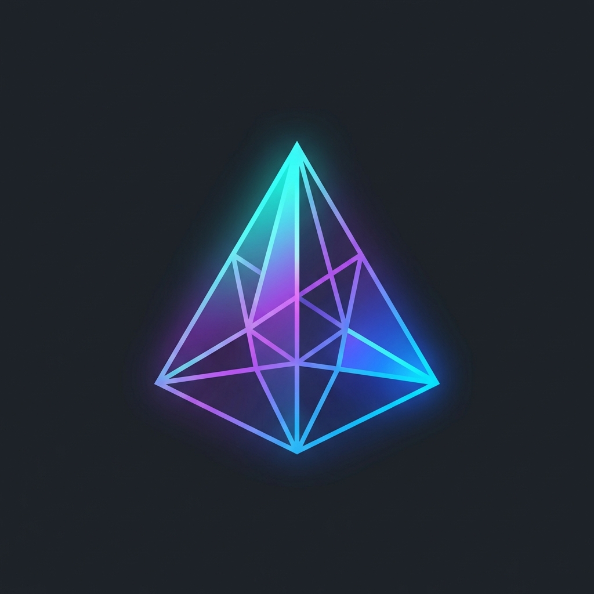

# PrismShell 

[](LICENSE)
[]()
[](https://tauri.app)
[](https://react.dev)

**PrismShell** is a next-generation terminal application designed to replace legacy tools like PuTTY with a modern, visually rich, and productivity-focused experience for developers and power users.

Built with **Rust** for performance and security, and **React** for a flexible, beautiful UI.

---

## 🚀 Features

- **Modern UI/UX**: A sleek, dark-themed interface inspired by modern editors like VS Code and Raycast.
- **Robust SSH Support**: Secure SSH v2 connections powered by a pure Rust backend (`russh`).
- **Profile Management**: Encrypted local storage for your connection profiles.
- **Theme System**: Custom JSON-based themes with live preview support.
- **Cross-Platform**: Designed for macOS, Linux, and Windows.

## 🛠️ Architecture

PrismShell leverages the "Prism Architecture" to separate concerns between the UI and the heavy-lifting core:

*   **Frontend (`src-ui`)**: React 19, TypeScript, TailwindCSS, Vite.
*   **Core (`src-core`)**: Rust, Tauri, `russh` (SSH engine), `keyring` storage.

## 📦 Installation

> **Note**: This project is currently in the **Development** phase.

### Prerequisites

*   [Node.js](https://nodejs.org/) (v18+)
*   [Rust](https://www.rust-lang.org/tools/install) (latest stable)
*   [Tauri CLI](https://tauri.app/v1/guides/getting-started/prerequisites)

### Build from Source

1.  **Clone the repository**:
    ```bash
    git clone https://github.com/ismailtsdln/PrismShell.git
    cd PrismShell
    ```

2.  **Install Frontend Dependencies**:
    ```bash
    cd src-ui
    npm install
    ```

3.  **Run Development Mode**:
    ```bash
    # From the project root
    npm run tauri dev
    # OR
    cargo tauri dev
    ```

## 🗺️ Roadmap

- [x] Initial Project Architecture
- [x] Core SSH backend implementation
- [x] Basic UI & Theme Engine
- [ ] PTY / Shell passthrough integration
- [ ] SFTP File Browser
- [ ] Plugin System (Lua/WASM)
- [ ] Cloud Sync (Optional)

## 🤝 Contributing

Contributions are welcome! Please check out the `CONTRIBUTING.md` (coming soon) for guidelines on how to proceed.

## 📄 License

This project is open-sourced under the MIT License - see the [LICENSE](LICENSE) file for details.
